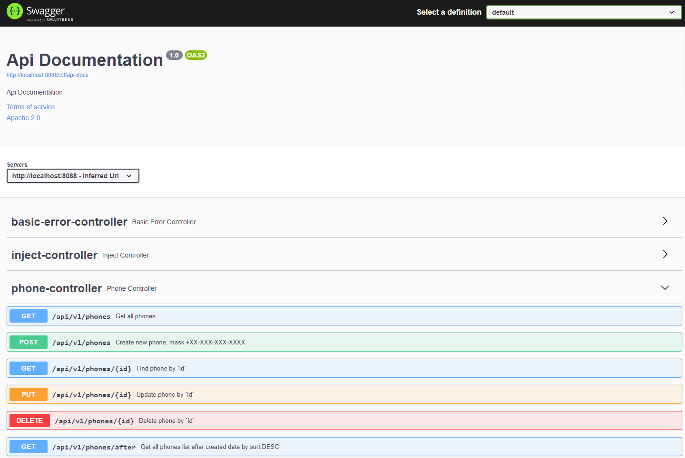

# Phonebook
## Project description:
REST application, for save phone number. It is built using SOLID principles 
and implemented as such functionalities such as add, update delete and find by id - User and Phone number.
It`s here find phone number after any date created too.

### Project based on 3-layer architecture:
 - Data access layer (DAO)
 - Application layer (services)
 - Presentation layer (controllers)

### Technologies that were used to create the service:
 - Spring boot
 - H2
 - Lombok
 - Maven Checkstyle Plugin
 - Docker
 - Swagger

### Used Swagger

### Database structure